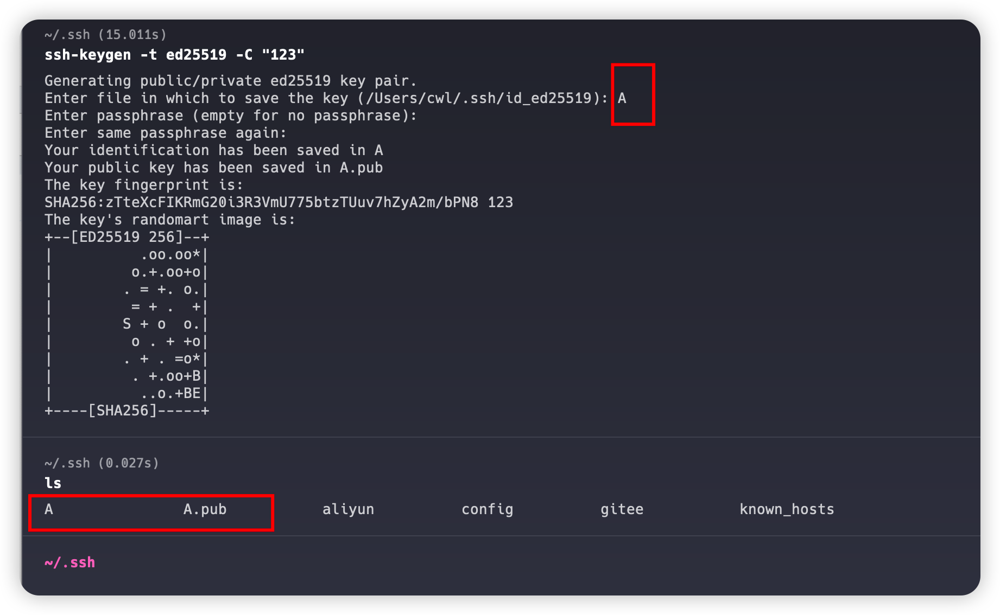
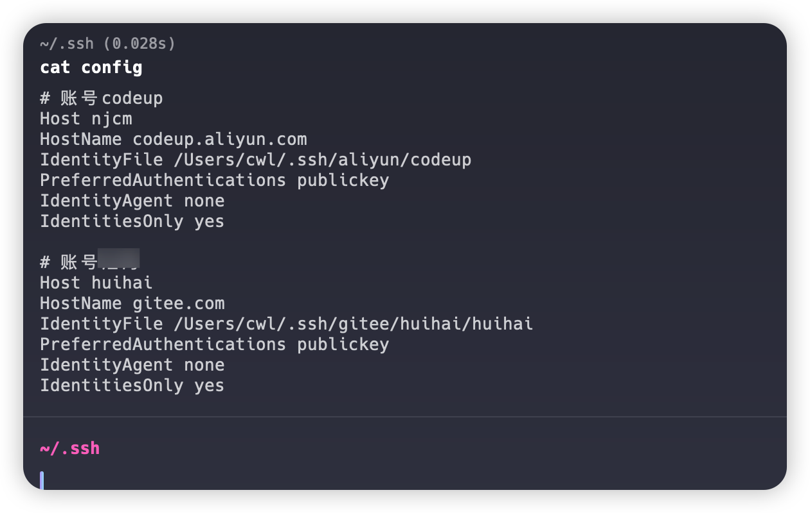

# Git SSH 多账号管理
## 情况说明
&nbsp;&nbsp;我的电脑是macOS系统，先说明一下我的需求。
目前我有3个账号:

* 账号1是A公司在阿里平台上的。
* 账号2是B公司gitee平台上。
* 账号3是我自己的在gitee平台上。

## 创建ssh秘钥

1.进入到用户目录下的 .ssh目录里
```
cd ~/.ssh
```
2.codeup.aliyun.com平台
```
ssh-keygen -t ed25519 -C "<注释内容>"
```
3.gitee.com平台
```
ssh-keygen -t ed25519 -C "Gitee SSH Key"
```
这里的 "<注释内容>" 和 "Gitee SSH Key" 你可以自定义，我一半都是输入邮箱或者我的名字

4.回车后根据提示确认

这里的提示输入最好手动设置一下，如果你在同一个平台上需要配置多个ssh的话。



> 我这里输入的是A，创建两个文件，其中文件A是私钥，A.pub是公钥，键入到对应平台的ssh配置里。
5. 其它ssh秘钥生成重复操作
## config配置文件
1. 在.ssh目录下创建文件 **config**
2. 输入内容
```
# 账号codeup
Host njcm
HostName codeup.aliyun.com
IdentityFile /Users/cwl/.ssh/aliyun/codeup
PreferredAuthentications publickey
IdentityAgent none
IdentitiesOnly yes

# 账号汇海
Host huihai
HostName gitee.com
IdentityFile /Users/cwl/.ssh/gitee/huihai/huihai
PreferredAuthentications publickey
IdentityAgent none
IdentitiesOnly yes
```


* host: 后面有用，会说到，自己定义
* hostName：对应的平台域名地址
* IdentityFile：对应私钥的文件路径

## 拉取代码
> 如我要拉去的仓库地址: git@gitee.com:cwljxf/halo-theme-joe2.0-cwl.git

由于我上面config文件中配置的host为huihai，所以就需要修改仓库地址，将@后面的域名换位huhai

如:
```
git@huihai:cwljxf/halo-theme-joe2.0-cwl.git
```

ps: 以上地址全为虚拟，记录使用


## github中使用代理的情况

```
# github chenweilong
Host github.com
HostName ssh.github.com
Port 443
ProxyCommand connect -H 127.0.0.1:7890 %h %p
IdentityFile C:\Users\cwl\.ssh\github\xxxx
PreferredAuthentications publickey
IdentityAgent none
IdentitiesOnly yes
```

**注意** ：

HostName: 当你指定443端口的时候，应该使用 ssh.github.com 地址